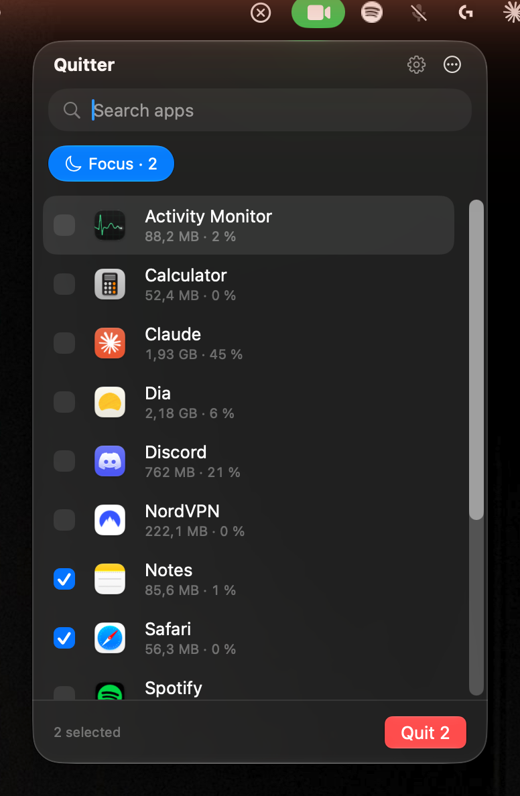
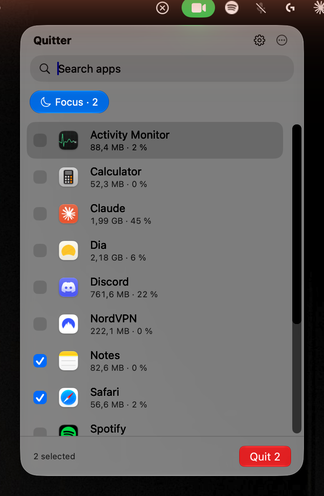

# Quitter

Quit several Mac apps at once from the menu bar.

Click the menu bar icon (or press your hotkey), tick the apps you're done with, press **Quit**.
Apps that refuse to close (an unsaved document, a hung process) get a **Force Quit** button on
their row after a few seconds. Quitter never force-quits anything on its own.

<p align="center">
  
  &nbsp;
  
</p>

## Features

- **Liquid Glass panel** listing every running Dock app with its icon, memory and CPU use
  (memory includes helper processes, matching Activity Monitor)
- **Multi-quit**: tick several apps, one click quits them all
- **Force Quit escalation**: a row that hasn't quit after 2–30 s (you choose) offers Force Quit
- **Quit Groups**: save a set of apps ("Focus" = Safari + Notes), select them with one click, or
  give a group its own hotkey that quits it without opening the panel
- **Global hotkey** to open the panel from any app
- **Keyboard first**: type to search, ↑/↓ to move, Space to tick, Return to quit, Esc to close
- **Protected apps** that never appear in the list (Finder by default; Quitter itself always)
- **Sort** by name, memory, CPU or launch time; rows don't jump around while numbers update
- **Menu bar tidy-up** (optional): pick the menu bar icons you rarely use from a list; they hide
  behind a small ‹ button and come back with one click. The apps keep running
- **Settings** window in the System Settings style; launch at login
- No network access, no analytics. No permissions needed, except Accessibility for the optional
  menu bar tidy-up (never Screen Recording)

## Requirements

- macOS 26 or later (built and tested on macOS 27)
- Xcode 26 (Swift 6.2 or later) to build

## Install

Quitter isn't notarized, so build it from source:

```bash
git clone https://github.com/zizo2001/quitter.git
cd quitter
make install
```

`make install` builds a release, signs it locally (ad-hoc), copies it to
`/Applications/Quitter.app` and launches it. The icon appears in the menu bar; there is no Dock
icon.

Other targets: `make run` (debug run, no bundle), `make test`, `make app` (build
`build/Quitter.app` only), `make icon` (regenerate the app icon).

## Usage

| Action | How |
|---|---|
| Open / close the panel | Click the menu bar icon, or your hotkey (Settings › Shortcuts) |
| Search | Just type |
| Move / tick | ↑ ↓ then Space |
| Select all / none | ⌘A / ⌘⇧A |
| Quit selected | Return or the Quit button |
| Close | Esc (clears the search first) |
| Settings | ⌘, or the gear; right-click the menu bar icon for more |

## Hiding menu bar icons

Settings › Menu Bar › **Hide selected menu bar icons** adds a `‹` button and a thin divider to the
menu bar and lists every app icon currently in it. Switch an icon on and Quitter moves it left of
the divider (the same ⌘-drag you could do by hand); click `‹` to hide or show them all. Revealed
icons hide again after 10 s (adjustable). Switching an icon off puts it back where it was.

It needs Accessibility permission (to read icon positions and move them) and nothing else: no
Screen Recording, no background polling. Hiding is a single change to the divider's width.

Limits on macOS 27: the divider is sized for the display whose menu bar you're using; on a second
display of very different width, hidden icons may show there. System icons (Wi-Fi, Sound, clock)
are managed in System Settings › Menu Bar.

## How it works

Plain AppKit + SwiftUI, built with Swift Package Manager (no Xcode project). Apps are quit with
`NSRunningApplication.terminate()`, the same request the Dock sends. Memory and CPU come from
`proc_pid_rusage`, summed over each app's child processes. The only dependency is
[KeyboardShortcuts](https://github.com/sindresorhus/KeyboardShortcuts) for the hotkey.

`PLAN.md` is the original design spec and `docs/VERIFICATION.md` records how every feature was
tested, including the macOS 27 quirks that were worked around.

## License

[MIT](LICENSE) © 2026 Aziz Ali
